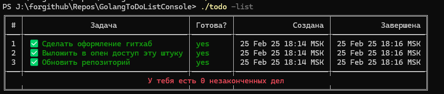

# GolangToDoListConsole by VechniyRabotnnik

## This code was made with the help of guides for self-learning purposes! / Данный код был сделан с помощью гайдов в целях самообучения!

## Info/Информация

# English

This code works in the bash or Powershell console. This is a simple task list that you can edit using the commands below.

+ `./todo -list` : Shows a table with tasks
+ `./todo -add` : Add a task
+ `./todo -del=id` : Delete a task
+ `./todo -complete=id` : Complete the task

# Russian

Этот код работает в консоли bash или Powershell. Это простой список задач, который вы можете редактировать с помощью приведенных ниже команд.

+ `./todo -list` : Показывает таблицу с задачами
+ `./todo -add` : Добавить задачу
+ `./todo -del=id` : Удалить задачу
+ `./todo -complete=id` : Завершить задачу
